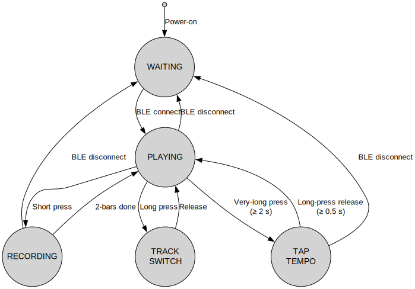

# Pico MIDI Looper: Architecture Overview

This document describes the internal architecture of the Pico MIDI Looper firmware. It is designed to explain how the system operates from a structural point of view, with an emphasis on clarity, simplicity, and extensibility.

## Overview

The Pico MIDI Looper is a BLE-MIDI-based loop recorder for Raspberry Pi Pico W.
It records and plays back a two-bar loop (32 steps) consisting of two drum tracks … In addition to recording, a tap-tempo mode lets you adjust the global BPM on the fly with the same single button.
Internally, the system is organized around two central mechanisms:

1. A **finite state machine (FSM)** governing the overall looper state
2. A **timer-driven sequencer** that drives the step clock and MIDI note output

## Looper State Machine

The firmware centres around a main FSM with five states: `Waiting / Playing / Recording / TrackSwitch / TapTempo`. The updated diagram reflects this.



- **Waiting**: Initial idle state before BLE connection is established.
- **Playing**: Default playback state, running the sequencer.
- **Recording**: Temporarily active while recording note input for 2 bars.
- **TrackSwitch**: Transition state when switching between drum tracks.
- **TapTempo**: temporary mode for tap-tempo BPM entry.


State transitions are triggered by BLE connection events and button presses. The state machine is evaluated on every step clock tick within the main loop logic.

## Sequencer Timing

The sequencer timer period is re-computed whenever the global BPM changes(e.g. after tap-tempo):

```c
/* updated every time looper_update_bpm() is called */
looper_status.step_duration_ms = 60000 / (current_bpm * LOOPER_STEPS_PER_BEAT);
btstack_run_loop_set_timer(&step_timer, looper_status.step_duration_ms);
```

- Each loop consists of 32 steps (4 beats × 4 subdivisions × 2 bars).
- A timer (btstack run loop timer) triggers every LOOPER\_STEP\_DURATION\_MS.
- On each tick, the looper updates the current step, outputs any matching notes, and transitions state if necessary.

## Button Handling

The BOOTSEL button is monitored by reading its state using a method specific to the Pico's onboard configuration.
An internal FSM (in `button.c`) detects three types of user actions:

- `BUTTON_EVENT_DOWN`
- `BUTTON_EVENT_SHORT_PRESS_RELEASE`
- `BUTTON_EVENT_LONG_PRESS_RELEASE`
- `BUTTON_EVENT_VERY_LONG_PRESS_BEGIN`

These events are interpreted by the looper (in `main.c`) depending on its current state:

- **Short Press**: Starts recording, and toggles a note at the quantized step.
- **Long Press(≥ 0.5 s)**: Switches to the next track.
- **Very-long press (≥2 s)**: enters Tap-tempo mode from Playing. Inside Tap-tempo a ≥0.5 s long-press confirms the BPM and returns to Playing.

## Track Structure

Each track is represented by a `track_t` structure containing:

- A note number (MIDI note)
- A MIDI channel
- A `pattern[]` bit array (one bool per step)
- An `undo_pattern[]` to revert recording on long press

Two tracks are predefined: `Bass` (note 36) and `Snare` (note 38), both on MIDI channel 10.

## BLE MIDI Integration

BLE MIDI communication is handled via BTstack. The system registers a MIDI service, advertises as `Pico`, and sends MIDI note-on messages via `att_server_notify` when a note is triggered.

The BLE connection status is monitored and used to gate playback and visual LED feedback.

## Code Structure Summary

| File             | Responsibility                                              |
| ---------------- | ----------------------------------------------------------- |
| `src/main.c`     | Looper state machine, step sequencer, button event handling |
| `src/button.c`   | Button press detection, debouncing, and press-type FSM      |
| `src/ble_midi.c` | BLE advertising and MIDI note delivery                      |

## Design Goals

- **Minimalism**: Core logic in under 400 lines of C
- **Readability**: Clear structure and FSM-based design
- **Extensibility**: Easy to add new tracks, note types, or input methods
- **Educational Value**: Suitable for workshops and experimentation
